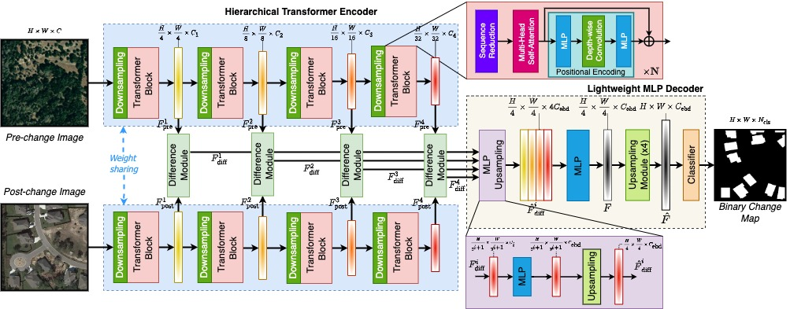

# ChangeFormer Change Detection

A focused PyTorch implementation of ChangeFormer for binary remote-sensing change detection.

This repository keeps the training, evaluation, demo, dataset, and utility code needed to run the main ChangeFormer model family. Older comparison architectures and their generated outputs have been removed so the project stays easier to maintain and publish.

## Architecture

The default model is `ChangeFormerV6`. It uses a Siamese setup: image `A` and image `B` pass through the same transformer encoder, the resulting multiscale features are compared and fused, and the decoder predicts a binary change map.



For `ChangeFormerV6`, the encoder feature scales are `1/2`, `1/4`, `1/8`, and `1/16` with channel sizes `[64, 128, 320, 512]`. The decoder embeds these feature maps, upsamples them to a shared resolution, fuses them, and predicts changed vs unchanged pixels.

## Project Structure

```text
.
|-- data_config.py          # Dataset root configuration
|-- main_cd.py              # Train and then evaluate a model
|-- eval_cd.py              # Evaluate a saved checkpoint
|-- demo_LEVIR.py           # Quick inference demo for LEVIR-style samples
|-- demo_DSIFN.py           # Quick inference demo for DSIFN-style samples
|-- datasets/               # Dataset and dataloader helpers
|-- data_preparation/       # Lightweight data statistics helper
|-- images/                 # README diagrams and visual assets
|-- misc/                   # Logging, metrics, image, and training utilities
|-- models/                 # ChangeFormer model and trainer/evaluator code
|-- samples_LEVIR/          # Small LEVIR-style demo sample
|-- samples_DSIFN/          # Small DSIFN-style demo sample
`-- scripts/                # Example train/eval shell scripts
```

## Requirements

The expected environment is:

```text
Python 3.8
PyTorch 1.10
torchvision 0.11
einops 0.3
```

Install the listed dependencies with your preferred environment manager:

```bash
pip install -r requirements.txt
```

## Dataset Format

Each dataset should follow this structure:

```text
data/
`-- LEVIR-CD256/
    |-- A/
    |   |-- train_0001.png
    |   |-- train_0002.png
    |   `-- ...
    |-- B/
    |   |-- train_0001.png
    |   |-- train_0002.png
    |   `-- ...
    |-- label/
    |   |-- train_0001.png
    |   |-- train_0002.png
    |   `-- ...
    `-- list/
        |-- train.txt
        |-- val.txt
        `-- test.txt
```

`A` contains the first-date images, `B` contains the second-date images, and `label` contains binary masks. The `list` files contain image names, one per line:

```text
train_0001.png
train_0002.png
train_0003.png
```

The same filename must exist in `A`, `B`, and `label`.

Update [data_config.py](data_config.py) so each dataset name points to your local dataset folder. By default, dataset roots are expected under `./data/`:

```python
elif data_name == 'LEVIR':
    self.label_transform = "norm"
    self.root_dir = './data/LEVIR-CD256/'
```

## Training

Run training directly:

```bash
python main_cd.py \
  --data_name LEVIR \
  --net_G ChangeFormerV6 \
  --embed_dim 256 \
  --checkpoint_root checkpoints \
  --vis_root vis \
  --batch_size 16 \
  --max_epochs 200 \
  --optimizer adamw \
  --lr 0.0001 \
  --loss ce \
  --multi_scale_train True \
  --multi_scale_infer False
```

Or use one of the scripts:

```bash
sh scripts/run_ChangeFormer_LEVIR.sh
sh scripts/run_ChangeFormer_DSIFN.sh
sh scripts/run_ChangeFormer_WHU.sh
sh scripts/run_ChangeFormer_TextCD.sh
```

Checkpoints are written to `checkpoints/<project_name>/`, and visualizations are written to `vis/<project_name>/`.

## Evaluation

Evaluate a trained checkpoint:

```bash
python eval_cd.py \
  --data_name LEVIR \
  --project_name ChangeFormer_LEVIR \
  --checkpoints_root checkpoints \
  --checkpoint_name best_ckpt.pt \
  --net_G ChangeFormerV6 \
  --embed_dim 256
```

The included evaluation script uses similar defaults:

```bash
sh scripts/eval_ChangeFormer_LEVIR.sh
```

## Quick Demos

The `samples_LEVIR` and `samples_DSIFN` folders contain tiny sample sets for checking the inference path.

Place a compatible checkpoint under `checkpoints/<project_name>/best_ckpt.pt`, then run:

```bash
python demo_LEVIR.py
python demo_DSIFN.py
```

Predictions are written under `outputs/`.


## Publishing As Your Own Repository

This folder is ready to initialize as a fresh repository:

```bash
git init
git add .
git commit -m "Initial ChangeFormer project"
git branch -M main
git remote add origin <your-repo-url>
git push -u origin main
```
